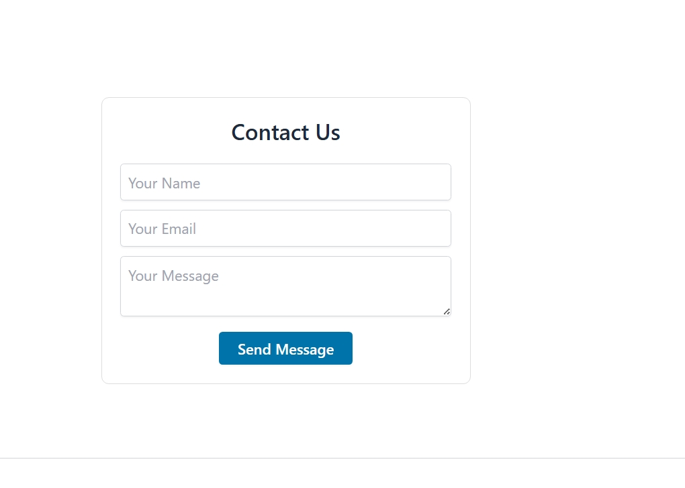
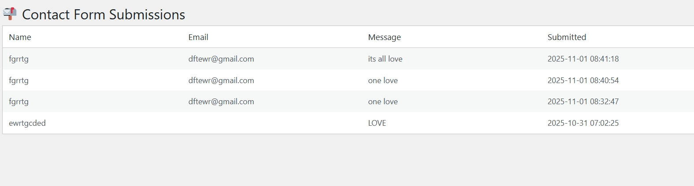

# Secure Contact Form

A simple, secure contact form plugin for WordPress.  
Protects against spam and injection using sanitization and WordPress nonces.

---

##  Features
- Input sanitization and validation  
- Nonce verification for security  
- Uses WordPress mail function  
- Easy to customize  
- Shortcode: [secure_contact_form]

---

##  Installation
1. Upload the secure-contact-form folder to /wp-content/plugins/
2. Activate the plugin via the Plugins menu.
3. Add the shortcode [secure_contact_form] to any page or post.

---

### Screenshots

1. Frontend Contact Form  
   

2. After Submission (Success Message)  
   

3. Backend Settings Page  
   

4. Plugin Active in Dashboard  
   

---

## Contributing
Pull requests are welcome!

---

## 📄 License
GPLv2 or later © 2025 Francis Righteous